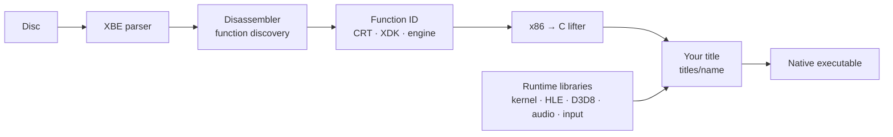

<div align="center">

```
 #   #  ####    ###   #   #         #####   ###    ###   #       ###
 #   #  #   #  #   #  #   #           #    #   #  #   #  #      #
  # #   ####   #   #   # #            #    #   #  #   #  #       ##
  # #   #   #  #   #   # #            #    #   #  #   #  #         #
 #   #  #   #  #   #  #   #           #    #   #  #   #  #         #
 #   #  ####    ###   #   #           #     ###    ###   #####   ###
```

### Static recompilation for the original Xbox

**Lift a retail XBE to C. Replace the Direct3D 8 it links with a modern renderer. Run it natively on Windows and Apple Silicon.**

[](https://github.com/phobos665/xboxrecomp/actions/workflows/ci.yml)


[Quick start](#quick-start) · [Title status](#title-status) · [How it works](#how-it-works) · [Documentation](#documentation) · [Contributing](CONTRIBUTING.md)

</div>

---

## What this is

xboxrecomp is a toolkit that turns an original Xbox (2001–2005) executable into a native program.
It disassembles the game's x86 code, lifts every function to C, and links the result against a
runtime that stands in for the Xbox kernel, the XDK, the GPU and the audio hardware.

There is no interpreter and no JIT. The game's own logic runs as compiled code on your CPU.

It is **title-agnostic**. The pipeline reads each game's layout, imports and XDK version from its
XBE rather than assuming them, and **more than twenty titles** are being brought up on it. Each
one has found something the toolkit wrongly treated as universal, and fixing that is how it grows.

> [!IMPORTANT]
> You supply the game. The repository ships tooling and runtime code, never game content, and
> recompiled output contains the game's code, so do not distribute it. You need a copy you own.
> Any PR into this repo, I expect you to only use your physically owned games. Do not submit any copyright material as a PR, or **I will ban your account from the repository.**

## Why not just use an emulator?

[xemu](https://github.com/xemu-project/xemu) and [Cxbx-Reloaded](https://github.com/Cxbx-Reloaded/Cxbx-Reloaded)
are excellent, and this project leans on both. Static recompilation is a different trade, and it
is worth being plain about where the win is and where it is not.

**CPU translation is not where the speed comes from.** The guest is x86-32, little-endian, and
the host is x86-64, little-endian. Same-ISA translation is already close to native, and a 733 MHz
Pentium III leaves enormous headroom. A frame's time goes into GPU work: push-buffer parsing,
PGRAPH state, texture invalidation. Lifting CPU code does not touch any of that.

**The performance win is high-level emulation at the Direct3D 8 boundary.** Direct3D 8 is
statically linked into every XBE as a known, versioned library, so the title's calls can be
recognised by name and handed to a modern renderer instead of being turned into NV2A commands and
back. That boundary is per XDK build, not per game, and there are a manageable number of builds.

What static recompilation gives you on top of that:

| | |
|---|---|
| ⚡ **Native code** | The game executes as compiled C, not as interpreted or translated guest code. |
| 🛠️ **Moddable** | The output is readable C. Patch a function, hook a call, change a render state. |
| 🧭 **Portable** | Guest memory is a base+offset arena, not fixed addresses. The same lifted C builds on Apple Silicon. |
| 🎛️ **Enhanceable** | Internal resolution, widescreen, frame interpolation and rebindable input sit in the HLE layer, not in the game. |
| 🗄️ **Preservable** | A game becomes a self-contained native program, with its behaviour written down as source. |

## Title status

Status is per title and moves quickly. The newest facts are in each title's bring-up document
under [docs/technical/](docs/technical/); this table is the summary.

| Title | XDK | Where it is |
|---|---|---|
| **TimeSplitters 2** | 4721 | **Playable**  |
| **BLiNX: the Time Sweeper** | 4831 | **In-Game** |
| **Mortal Kombat: Deadly Alliance** | 4721 | **In-Game** Reaches its Arcade fights. Cooperative tasks run on host fibers ([how](docs/technical/mkda-coroutine.md)). |
| **Hunter: The Reckoning** | 4361 | **In-Game** Menus, cinema and the first level at 60 fps, with scripted input. [Notes](docs/technical/hunter-bringup.md). |
| **Halo: Combat Evolved** | 3925 | **In-Game** Main menu, opening cinematic and the first level's cryo bay. [Notes](docs/technical/halo-bringup.md). |
| **Burnout 2** | 5344 | **In-Game** Logos, menus, HUD and the race, drawn with the title's own vertex programs and register combiners. |
| **TimeSplitters: Future Perfect** | 5849 | **Menus** Reaches its front end. A memory fault in the title's arena fill blocks the menu. |
| **Need for Speed: Underground 2**, **WWE Raw 2** | | **In-Game** |

All games tested were legitimate **owned** versions of these games.

## Quick start

### Prerequisites

- **Windows 10/11**, **macOS on Apple Silicon**, or **Linux**. Windows uses D3D11 by default;
  macOS (via MoltenVK) and Linux use the Vulkan renderer. Vulkan builds need a
  [Vulkan SDK](https://vulkan.lunarg.com/), which provides the loader, DXC and its headers.
- **Python 3.10+** with `capstone` (`pip install capstone`)
- **CMake 3.20+** and a C compiler: Visual Studio 2022 or the 2019 Build Tools on Windows
  (the Build Tools bring a CMake of their own), clang with Ninja on macOS, GCC on Linux
- **XbSymbolDatabase** (MIT), the submodule `third_party/XbSymbolDatabase`. `tools.xdk_symbols`
  uses it to name the XDK functions linked into a title
- A game disc image you own

`py -3` below is the Windows Python launcher. On macOS and Linux use `python3`.
macOS specifics are in [docs/GETTING_STARTED.md](docs/GETTING_STARTED.md).

### From disc to running game

Four stages turn a disc into C, and one script runs all of them. The long version, which
explains why each flag is there, is [docs/GETTING_STARTED.md](docs/GETTING_STARTED.md).

```bash
# 1. Clone with submodules, and build the XDK symbol tool once.
git clone --recurse-submodules https://github.com/phobos665/xboxrecomp.git
cd xboxrecomp
cmake -S third_party/XbSymbolDatabase -B third_party/XbSymbolDatabase/build
cmake --build third_party/XbSymbolDatabase/build --config Release

# 2. Extract your disc (xdvdfs, extract-xiso or tools/xiso) into games/<title>/,
#    so that games/<title>/default.xbe exists beside the rest of the disc.

# 3. Make the project the executable is built from: a copy of the template.
cp -r templates/new-game titles/<name>
#    Set project(<name>_recomp C) in titles/<name>/CMakeLists.txt and point
#    XBOXRECOMP_DIR in the same file at this repository.

# 4. Recompile: parse, disassemble, identify, lift. Give every title its own
#    --work-dir and --project, or a second title silently overwrites the first.
py -3 scripts/recompile.py "games/<title>/default.xbe" \
    --work-dir games/_pipeline/<name>/out --project titles/<name>

# 5. Tell the entry point where to start (the parse leaves it in
#    games/<title>/default_analysis.json as "entry_point").
py -3 scripts/regen_title_main.py <name> "Nice Name" 0x001CF3C9 "<title>"

# 6. Build it.
cmake -S titles/<name> -B titles/<name>/build -G "Visual Studio 16 2019" -A x64
cmake --build titles/<name>/build --config Release

# 7. Run it.
titles/<name>/build/Release/<name>_recomp
```

`<name>` is what you call the project and `<title>` is the folder your disc was extracted into.
They can differ: `games/Time Splitters 2/` builds `titles/timesplitters2/`.

> [!NOTE]
> This repository builds **libraries only**. The executable comes from *your* game project in
> `titles/<name>/`, which links them. Commit its `CMakeLists.txt`, `src/main.c` and
> `src/recomp_manual.c` (hand-written replacements for functions the lifter cannot translate).
> The generated C and the stage output are not source.

By default only the game's own code is lifted (`--game-only`). CRT and XDK code is replaced at the
boundary rather than translated, which builds faster and is easier to debug. Use `--all` when you
need everything.

### Running a build

The executable runs the game on its own. Double-click it or make a shortcut. It looks for the
game in a `game` folder beside itself, then in `games/<title>/` relative to itself, then at
`RECOMP_GAME_DIR`. It is a windowed program, so diagnostics go to whatever redirected them, else
to the terminal that started it, else to `<executable>.log` beside it.

| Key | Does |
|---|---|
| **F9** | Show the frame rate |
| **F10** | Step the frame cap: adaptive, 60, 30, off |
| **F11** | Save the screen as a BMP and a replayable capture, which is how to report a rendering bug |

A keyboard works out of the box, and so does a pad. `py -3 -m tools.input_ui` rebinds either for
up to four players ([details](docs/technical/input-binding.md)). A title can also build a small
**launcher** for resolution scale, widescreen, frame cap and input; it is optional and opt-in
([src/launcher/](src/launcher/)).

### The first run will crash

That is normal, and it is the process rather than a failure of it:

1. **Boot** past the entry point.
2. **Stub** what touches hardware you have not implemented.
3. **Resolve indirect calls.** Vtables and function pointers are the hardest tenth.
4. **Add runtime** (kernel calls, D3D calls, input) as the title asks for them.
5. **Debug** with the call trace, memory watchpoints and the frame capture.
6. **Iterate.** Each crash teaches something, and most of the fixes land in the toolkit.

[docs/pipeline/06-debugging.md](docs/pipeline/06-debugging.md) is the debug loop, and
[docs/technical/memory-watchpoints.md](docs/technical/memory-watchpoints.md) answers "who wrote
this value" in three runs.

## How it works



| Stage | Tool | Does |
|---|---|---|
| Parse | `tools/xbe_parser` | Headers, sections, kernel imports, certificate |
| Disassemble | `tools/disasm` | Function discovery, control flow, jump tables |
| Identify | `tools/func_id`, `tools/xdk_symbols` | Names CRT, XDK and engine functions |
| Lift | `tools/recomp` | Translates x86, x87 and SSE to C, with a differential test against the host CPU |
| Build | `templates/`, `src/` | The runtime your title links |

### The runtime

```
┌────────────────────────────────────────────────────────┐
│  Your title (.exe)                                     │
│   recomp/gen/*.c      recomp_manual.c      main.c      │
│   (lifted code)       (hand overrides)     (boot)      │
├────────────────────────────────────────────────────────┤
│  xboxrecomp libraries                                  │
│                                                        │
│   kernel      Xbox kernel ordinals, XAPI, memory,      │
│               files, threads, FATX saves               │
│   hle         The XDK replaced by name: D3D8,          │
│               DirectSound, XMV movies                  │
│   d3d         Renderer: register combiners and vertex  │
│               programs to HLSL, then D3D11 or Vulkan   │
│   apu / nv2a  Hardware models, from xemu               │
│   audio       Software mixer and host output           │
│   input       Pad and keyboard, with bindings          │
│   host        Window, events, sound device (SDL3)      │
├────────────────────────────────────────────────────────┤
│  Windows: D3D11 / XInput    macOS · Linux: Vulkan / SDL3│
└────────────────────────────────────────────────────────┘
```

**HLE with a safety net.** Each replaced XDK function runs the title's own body first, and in
*shadow mode* repeats the call on a host device in a second window. That makes it possible to
bring a title up on its own code, and then move draws to the fast path one function at a time.
See [Shadow mode](docs/technical/shadow-mode.md).

**One renderer, two backends.** The shader generators emit HLSL, which is compiled to DXBC for
D3D11 or to SPIR-V through DXC for Vulkan. On macOS that runs on MoltenVK.
See [the Vulkan backend](docs/technical/vulkan-backend.md).

**Capture and replay.** F11 records one frame's host calls. Replaying a capture draws that frame
with no game running, so two backends can be compared on identical input.

**Memory.** Guest pointers stay 32-bit. On Windows the Xbox address map is reproduced at its own
addresses with mirror views; on arm64 macOS, which reserves the low 4 GB, guest memory is a 4 GB
arena at a base offset, and faults on device ranges are handled by a load/store emulator.
See [Memory layout](docs/technical/memory-layout.md).

**Threads.** Guest code assumes a uniprocessor. On arm64 a guest lock lets one guest thread run
lifted code at a time, handing over at loop back-edges and blocking calls, and is scheduled the
way the console would schedule it.

### Platform support

| Host | Renderer | State |
|---|---|---|
| Windows x64 | D3D11 (Vulkan with `RECOMP_D3D8_BACKEND=vulkan`) | Reference platform. |
| macOS arm64 | Vulkan on MoltenVK | TimeSplitters 2 and BLiNX run at 60 fps with sound. |
| Linux | Vulkan | The runtime builds and its tests pass in CI. No title has been run there yet. |

## Documentation

**Start here**
- [INSTRUCTIONS.md](INSTRUCTIONS.md): the whole journey on one page
- [Getting Started](docs/GETTING_STARTED.md): from XBE to running game, with the reasons
- [Tools reference](tools/README.md) and [runtime libraries](src/README.md)
- [Decompilation guide](docs/DECOMP.md): using the toolkit as a function splitter, without ever lifting

**Pipeline**: [XBE parsing](docs/pipeline/01-xbe-parsing.md) ·
[disassembly](docs/pipeline/02-disassembly.md) · [function ID](docs/pipeline/03-function-id.md) ·
[lifting](docs/pipeline/04-lifting.md) · [runtime](docs/pipeline/05-runtime.md) ·
[debugging](docs/pipeline/06-debugging.md)

**Runtime modules**: [kernel](src/kernel/README.md) · [D3D8](src/d3d/README.md) ·
[DirectSound](src/audio/README.md) · [APU](src/apu/README.md) · [NV2A](src/nv2a/README.md) ·
[input](src/input/README.md)

**Deep dives**
- Rendering: [Shadow mode](docs/technical/shadow-mode.md) ·
  [Vulkan backend](docs/technical/vulkan-backend.md) ·
  [NV2A shader translation](docs/technical/nv2a-shaders.md) ·
  [Frame interpolation](docs/technical/frame-interpolation.md) ·
  [Resolution and frame rate](docs/technical/resolution-and-framerate.md) ·
  [Widescreen](docs/technical/widescreen-and-resolution.md)
- Runtime: [Register model](docs/technical/register-model.md) ·
  [Memory layout](docs/technical/memory-layout.md) ·
  [Indirect calls](docs/technical/indirect-calls.md) ·
  [Kernel replacement](docs/technical/kernel-replacement.md) ·
  [SEH](docs/technical/seh-handling.md) ·
  [C++ exceptions](docs/technical/cpp-exceptions.md)
- Debugging: [Memory watchpoints](docs/technical/memory-watchpoints.md) ·
  [xemu as an oracle](docs/technical/xemu-debugging.md) ·
  [Conformance testing](docs/technical/conformance-testing.md)
- Project: [Lessons learned](docs/technical/lessons-learned.md) ·
  [Gap analysis vs xemu](docs/technical/gap-analysis.md) ·
  [Candidate games](docs/technical/candidate-games.md) ·
  [Modding models and textures](docs/technical/modding-models-textures.md)
- Formats: [XBE](docs/formats/xbe.md) · [kernel exports](docs/formats/kernel-exports.md)

## Repository layout

```
xboxrecomp/
├── tools/          Python pipeline: xbe_parser, disasm, func_id, abi_analysis, recomp, ...
├── src/            Runtime libraries (C): kernel, hle, d3d, audio, apu, nv2a, input, host, launcher
├── templates/      new-game/ (copy this to start a title) and the runtime headers the lifter targets
├── titles/         One project per title: CMakeLists, main.c, recomp_manual.c
├── games/          Your game files and pipeline output (never committed)
├── scripts/        recompile.py, regen_title_main.py, survey_xbe_library.py, regress.py, ...
├── third_party/    XbSymbolDatabase, SDL3, Vulkan headers
└── docs/           pipeline/, technical/, formats/, runtime/
```

## Choosing a target

| | Easier | Harder |
|---|---|---|
| Engine | A documented one, such as RenderWare | A custom engine |
| Threading | Single-threaded | Heavy cross-thread synchronisation |
| GPU | Standard D3D8 calls | Hand-written push buffers |
| Code | Small `.text`, few demand-loaded sections | Large, or many streamed sections |
| Online | Offline | Xbox Live dependent |

`scripts/survey_xbe_library.py` reads XBE headers and ranks a folder of discs by XDK version,
D3D8 versus D3D8LTCG, library list, engine and size. It cannot see hand-rolled push buffers or
whether you want to play the game, so treat the ranking as a start.

```bash
python3 scripts/survey_xbe_library.py /path/to/extracted/discs --csv survey.csv
```

## Development

```bash
py -3 -m pytest tools/            # unit tests, no game files needed
py -3 -m tools.conformance        # lifted C against the real CPU (needs 32-bit MSVC)
bash tools/macos/run_tests.sh     # the same on macOS
```

The conformance suite assembles each snippet, lifts the bytes, then runs the lifted C *and* the
original instructions over the same inputs and requires them to agree. Because the target and the
host are both x86, the CPU itself is the oracle. If you fix a lift, add the case.
See [Conformance testing](docs/technical/conformance-testing.md).

The core pipeline needs only Python and Capstone. Ghidra and IDA helpers under `tools/` recover
symbol names and are never required.

**Scripted runs** should always set `RECOMP_SAVE_DIR=<fresh folder>`, `RECOMP_MUTE=1` and
`RECOMP_WINDOW_BACKGROUND=1`, so a test never touches a player's saves or takes the focus.

## How you can help

1. **Bring up a new title.** Follow the pipeline and see how far it gets. Partial results show where the toolkit is wrong.
2. **Improve the lifter.** An unhandled instruction lifts to a bare `/* mnemonic */` comment, so grepping generated output finds the gaps.
3. **Identify more of the XDK.** Signature coverage is per XDK build, and every new build opens up more titles.
4. **Cover more of the kernel.** `py -3 -m tools.kernel_audit.coverage` says, per title, what is missing.
5. **Run it on Linux.** The runtime builds and tests pass, and nobody has played a game there.
6. **Write down what you learn.** Formats, engines and failure modes help the next person.

Read [CONTRIBUTING.md](CONTRIBUTING.md) first. Contributors are credited in
[CONTRIBUTORS.md](CONTRIBUTORS.md), including people who never sent a patch and found the wall
everyone else was about to hit.

## FAQ

**Is this legal?** The repository holds tools, runtime code and documentation, and no game code or
assets. You must own a copy of any game you recompile, and recompiled binaries contain the game's
code, so do not share them.

**How is it different from an emulator?** An emulator interprets or translates guest code while it
runs. Here the whole binary is translated ahead of time into C that compiles to an ordinary
executable. What it still shares with an emulator is the hardware model: kernel, GPU and audio are
reimplemented, and most per-title effort goes there.

**Will it be faster than xemu?** Only where the Direct3D 8 layer is replaced rather than emulated.
Lifted CPU code on its own does not beat a tuned JIT, since guest and host share an instruction
set. The gains that do hold are HLE at the D3D8 boundary, hosts that are not x86 (where translation
is no longer same-ISA), and the ability to mod and enhance the result.

**Can I use it on Xbox 360 games?** No. Please refer to
[XenonRecomp](https://github.com/hedge-dev/XenonRecomp) and [ReXGlue](https://github.com/rexglue/rexglue-sdk).

**Why C rather than direct binary translation?** C is portable and readable, you can set
breakpoints in it and change individual functions, and the compiler optimises it.

## License

**GPL-3.0**, see [LICENSE](LICENSE). Third-party components keep their own licences, and
[NOTICE](NOTICE) lists each with the copyright it carries.

| Component | Licence | Credit |
|---|---|---|
| DirectSound replacement in `src/hle/` | GPL-3.0 | Adapted from [doaxbv-re](https://github.com/NoRain211/doaxbv-re) (NoRain211 and contributors) |
| MCPX APU sources in `src/apu/` | LGPL-2.1-or-later | espes, Jannik Vogel, Matt Borgerson, from xemu |
| `src/nv2a/nv2a_regs.h` | LGPL-2.1-or-later | espes, Jannik Vogel, from xemu |
| Earlier xboxrecomp code | MIT | See [Acknowledgements](#acknowledgements) |

[LICENSES/LGPL-2.1.txt](LICENSES/LGPL-2.1.txt) ships with the LGPL files because the licence
requires it. LGPL-2.1 permits linking those files from other code, so a recompiled game is
unaffected; what it asks is that notices stay and the library source stays available.

## Changelog

Release notes are in [CHANGELOG.md](CHANGELOG.md).

## Acknowledgements

This project stands on other people's work.

- **[sp00nznet/xboxrecomp](https://github.com/sp00nznet/xboxrecomp)** is where this began. Its
  author built the first public static recompilation toolkit for the original Xbox, proved it on
  Burnout 3, and released it under MIT, whose notice is kept in
  [LICENSE.upstream-MIT](LICENSE.upstream-MIT). The disassembler, lifter, parser and first
  runtime started there.
- **[xemu](https://github.com/xemu-project/xemu)** is the reference for how the hardware behaves,
  and the source of the APU and NV2A register code under LGPL-2.1-or-later. Several things here
  were learned from reading it.
- **[Cxbx-Reloaded](https://github.com/Cxbx-Reloaded/Cxbx-Reloaded)** pioneered high-level
  emulation of the XDK, and its fifteen years of signature work through
  [XbSymbolDatabase](https://github.com/Cxbx-Reloaded/XbSymbolDatabase) is what makes naming a
  title's D3D8 and DirectSound possible at all.
- **[doaxbv-re](https://github.com/NoRain211/doaxbv-re)** supplied the DirectSound model and ADPCM
  decoder adapted here.
- **[N64Recomp](https://github.com/N64Recomp/N64Recomp)**,
  **[XenonRecomp](https://github.com/hedge-dev/XenonRecomp)** and
  **[ReXGlue](https://github.com/rexglue/rexglue-sdk)** showed that the approach works on other
  consoles.
- The **[Xbox Dev Wiki](https://xboxdevwiki.net)** and
  [Copetti's Xbox architecture write-up](https://www.copetti.org/writings/consoles/xbox/) are the
  best public descriptions of the machine.
